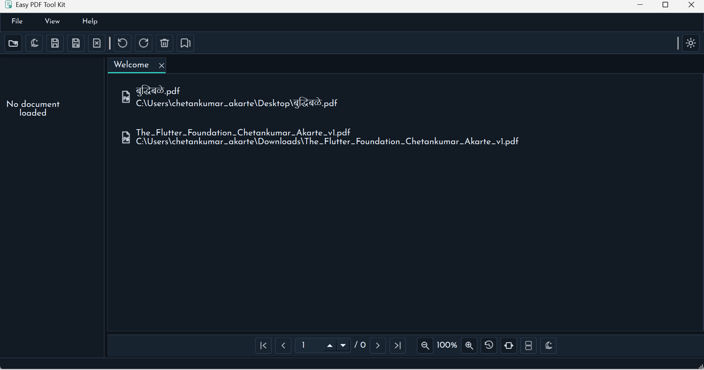
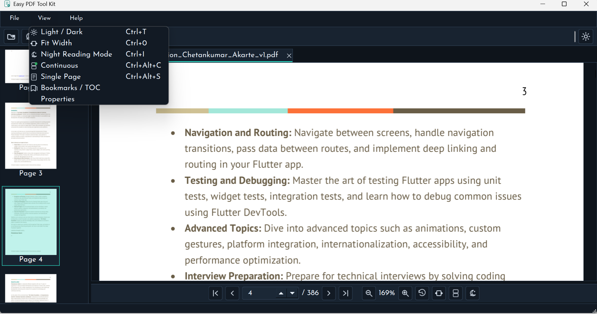
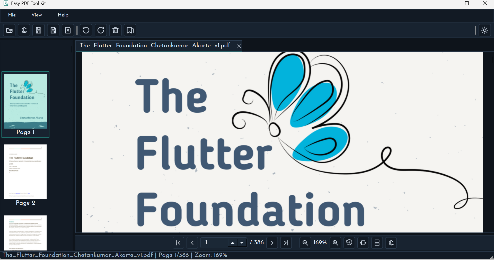
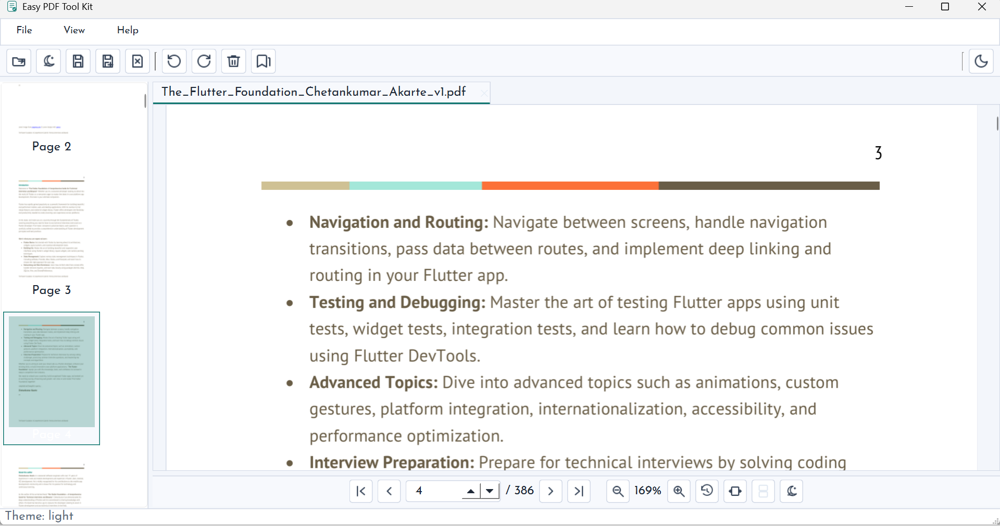
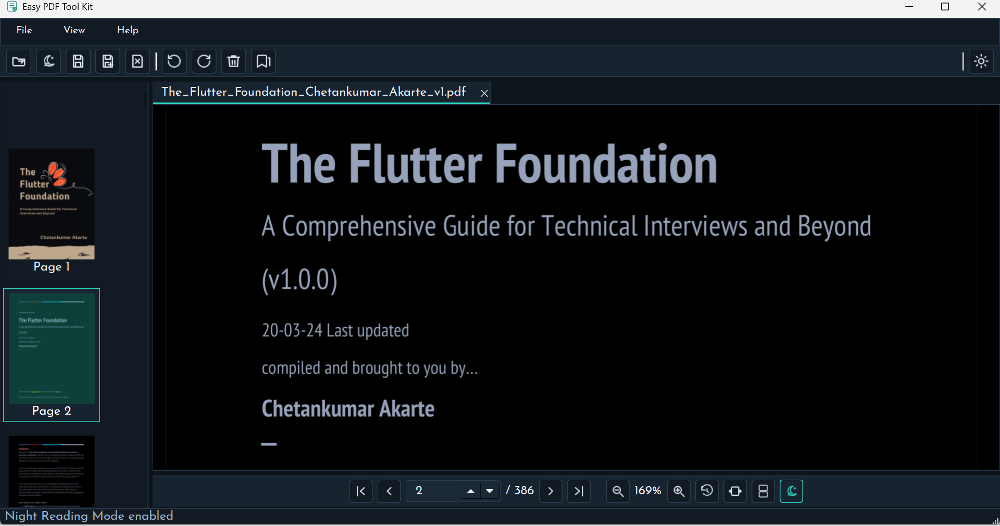
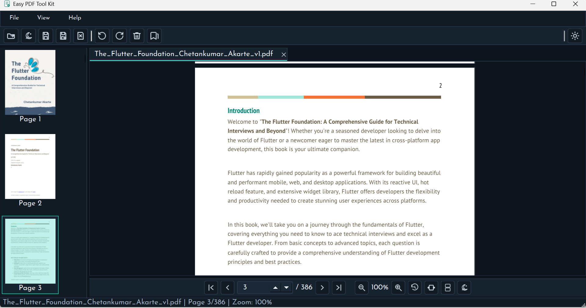
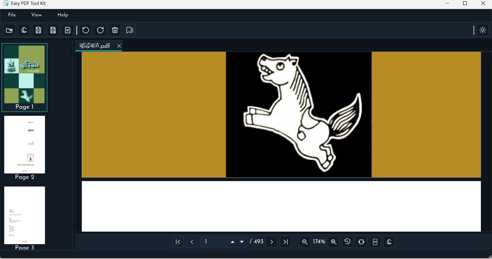
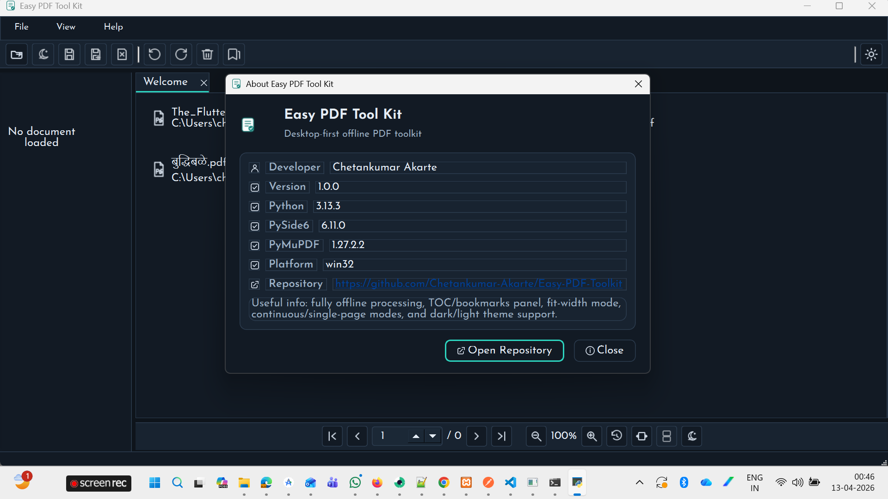

# Easy PDF Tool Kit

A desktop-first, fully offline PDF toolkit built with Python and PySide6. View, navigate, and edit PDF documents without uploading files to any server or cloud service.

> **Status:** Active development — advanced reader experience is ready; editing and annotation features are in progress.

---

## Features

### Implemented

- **PDF Viewer** — Multi-tab document viewer with smooth zoom, fit-to-width and fit-to-height modes, viewport-stable scroll, and better HiDPI rendering
- **Thumbnail Panel** — Sidebar thumbnail strip with click-to-navigate and compact list behavior
- **TOC / Bookmarks Panel** — Toggleable outline panel with collapse control for fast section navigation
- **Page Navigation** — First / Previous / Next / Last page controls and page number input
- **Display Modes** — Continuous and Single Page reading modes (menu + bottom quick toggle)
- **Reading Modes** — Light / dark app themes and Night Reading Mode (PDF invert) with quick toggle
- **Zoom Controls** — Zoom in / out / reset with customizable level, viewport anchor preserved on zoom
- **File Operations** — Open, Save (incremental), Save As with overwrite confirmation, Close tab
- **Recent Documents** — Welcome screen lists last 10 opened files sorted by most recently opened; click to reopen; missing files are cleaned up automatically; clear history action included
- **Persistent Settings** — Window size, position, and last-used folder remembered between launches
- **Keyboard Shortcuts** — `Ctrl+O` Open, `Ctrl+S` Save, `Ctrl+Shift+S` Save As, `Ctrl+W` Close, `Ctrl+Q` Exit
- **About Dialog** — Help > About with app metadata, runtime details, and repository link

### Roadmap

- Rendering parity polish — final quality alignment with reference viewer in all zoom/night scenarios
- Page operations — rotate, delete, reorder, insert blank, extract, merge, split
- Text search — highlight navigation across pages
- Annotations — text, highlight, underline, strikeout, sticky note, freehand draw
- Overlay editing — add text boxes, images, shapes, stamps, signatures
- Utilities — watermark, page numbering
- OCR — scanned PDF / image to searchable PDF (offline, Tesseract)
- Batch tools — merge, split, compress, watermark, OCR across multiple files
- Forms — fill and flatten PDF forms
- Password — protect and remove (authorized flow only)
- Undo / redo command history

---

## Tech Stack

| Layer            | Library                                                                 |
| ---------------- | ----------------------------------------------------------------------- |
| UI Framework     | [PySide6](https://doc.qt.io/qtforpython/) (Qt 6)                        |
| PDF Rendering    | [PyMuPDF (fitz)](https://pymupdf.readthedocs.io/)                       |
| PDF Manipulation | [pypdf](https://pypdf.readthedocs.io/)                                  |
| OCR (planned)    | [Tesseract](https://github.com/tesseract-ocr/tesseract) via pytesseract |
| Language         | Python 3.11+                                                            |

---

## Quick Start

### Prerequisites

- Python 3.11 or higher
- Windows, macOS, or Linux

### Installation

```powershell
# Clone the repository
git clone https://github.com/Chetankumar-Akarte/Easy-PDF-Toolkit.git
cd Easy-PDF-Toolkit

# Create and activate a virtual environment
python -m venv .venv
.venv\Scripts\Activate.ps1        # Windows PowerShell
# source .venv/bin/activate        # macOS / Linux

# Install dependencies
pip install -r requirements.txt
```

### Run

```powershell
python -m app.main
```

### Repository

- GitHub Repo: [https://github.com/Chetankumar-Akarte/Easy-PDF-Toolkit](https://github.com/Chetankumar-Akarte/Easy-PDF-Toolkit)

---

## Screenshots

### Dashboard



### Menus



### Dark Mode



### Light Mode



### Night Reading Mode



### Fit To Width



### Continuous Reading



### About Dialog



---

## Project Structure

```
Easy-PDF-Toolkit/
├── app/
│   ├── main.py                  # Entry point
│   ├── bootstrap.py             # App bootstrap / DI wiring
│   ├── ui/
│   │   ├── main_window.py       # Main application window
│   │   ├── widgets/
│   │   │   └── pdf_canvas.py    # Scrollable multi-page PDF canvas
│   │   ├── panels/              # Thumbnail panel, side panels
│   │   └── dialogs/             # About and other dialogs
│   ├── core/
│   │   ├── services/            # DocumentService, PageService (business logic)
│   │   ├── models/              # Domain models and dataclasses
│   │   ├── commands/            # Command objects for undo/redo
│   │   └── jobs/                # Background job definitions
│   ├── infra/
│   │   ├── pdf_engines/         # PyMuPDF and pypdf adapters
│   │   ├── storage/             # Settings and recent files persistence
│   │   ├── ocr/                 # Tesseract adapter
│   │   └── logging/             # Structured logging setup
│   └── resources/
│       ├── icons/               # SVG toolbar icons
│       └── themes/              # Light / dark theme stylesheets
├── tests/
│   ├── unit/
│   ├── integration/
│   └── golden/
├── scripts/                     # Helper / maintenance scripts
├── screenshot/                  # App screenshots used in this README
├── requirements.txt
└── Development Plan.md          # Full roadmap and execution plan
```

---

## Contributing

1. Fork the repository and create a feature branch.
2. Follow the layered architecture — UI code stays in `app/ui`, business logic in `app/core`, I/O in `app/infra`.
3. Run `python -m compileall app` before submitting a pull request.
4. Open an issue first for large features or breaking changes.

---

## Author

**Chetankumar Akarte**

- GitHub: [@Chetankumar-Akarte](https://github.com/Chetankumar-Akarte)

---

## License

This project is licensed under the MIT License. See [LICENSE](LICENSE) for details.
